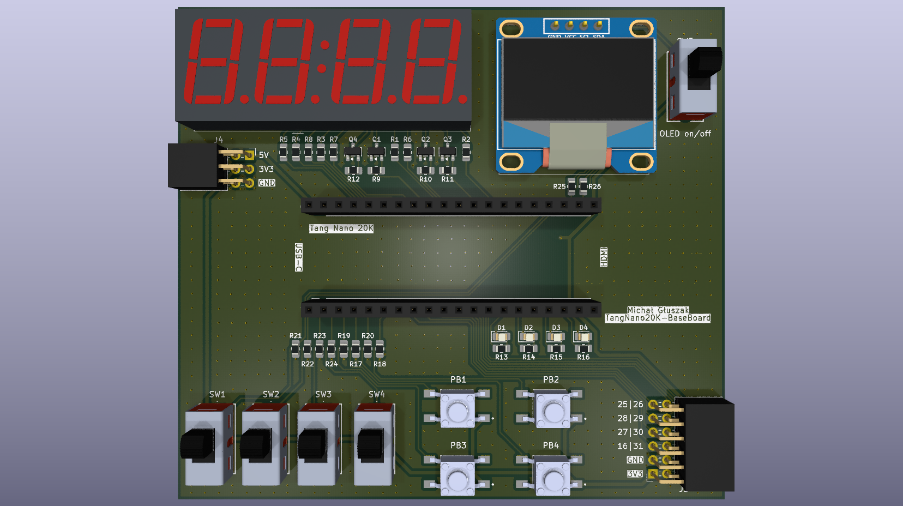
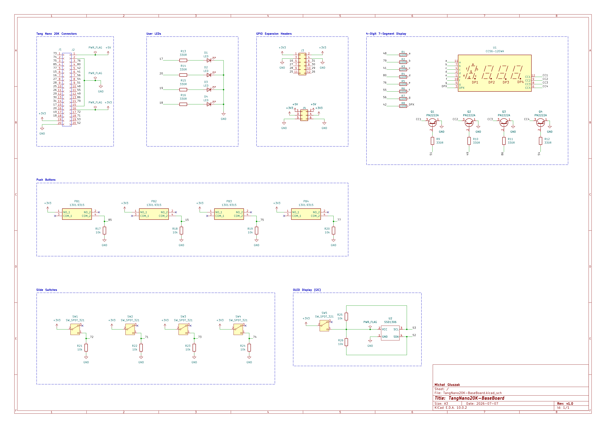
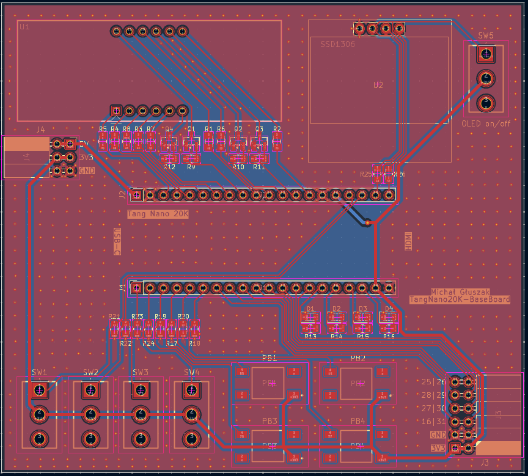
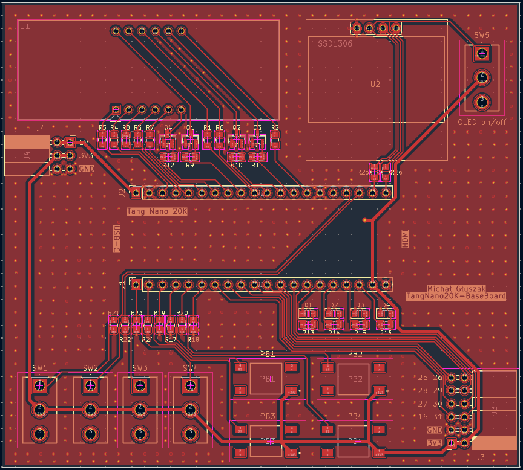
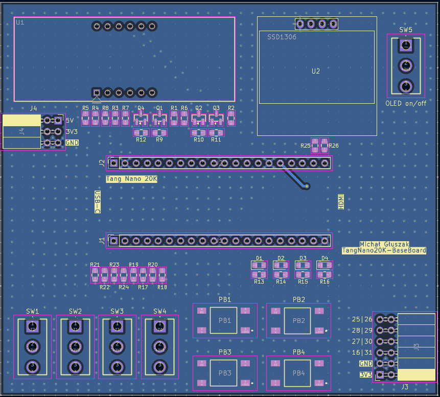

# Tang Nano 20K Evaluation Board

## About the Project

The **Tang Nano 20K Evaluation Board** is a custom motherboard designed to make learning and prototyping digital circuits easier using Hardware Description Languages (HDL), like Verilog and VHDL.

The idea for this project came from a desire to test written code in practice. Commercial evaluation platforms, like Basys 3 or boards based on Artix 7 chips, are relatively expensive. As an alternative, I chose the Tang Nano 20K chip, which offers great features at a very affordable price (around 120 PLN). To make working with this module easier, I designed a dedicated expansion board.

A huge advantage of this solution is its modularity – the Tang Nano 20K module is not soldered permanently. It is placed in pin headers, so you can take it out anytime and use it in another project directly on a breadboard.

## Features

* **Budget-friendly alternative:** A full evaluation environment for learning FPGA at a fraction of the cost of commercial solutions.
* **Modularity (Plug & Play):** The ability to easily remove the Tang Nano chip and use it outside the motherboard.
* **Data visualization:** Built-in **4 LEDs**, a **4-digit 7-segment display** (perfect for testing things like BCD decoders or counters), and support for an **OLED screen**, which makes viewing results and fast code debugging much easier.
* **Input interface:** The board has **4 push-buttons** and **4 slide switches**, which are necessary for manually setting logic states (0/1) and testing state machines.
* **Expandability (PMOD):** An integrated PMOD standard connector allows you to easily connect a wide range of external peripheral modules, such as sensors (e.g., temperature), converters, or additional interfaces.

## PCB Technical Specifications

Due to the nature of FPGA chips and fast digital signals, during the PCB design in KiCad, I put special focus on Signal Integrity and the elimination of electromagnetic interference (EMI).

* **Board dimensions:** 100 mm x 90 mm.
* **Signal trace width (0.25 mm):** Routed tightly and compactly to minimize their length and delays.
* **Power trace width (0.6 mm):** Widened to ensure proper current capacity and a stable voltage for the FPGA chip.
* **Single-layer topology (almost):** All routing of signal and power traces was done on the top layer (Top Layer). I only moved one trace to the bottom layer (Bottom Layer) because there was no space on top. Thanks to this, the bottom layer is an unbroken return plane.
* **Ground Planes:** I applied ground planes (GND copper pours) on both layers (Top and Bottom), which provides excellent shielding.
* **Via Stitching:** To balance potentials and minimize ground loop impedance, I connected the top and bottom GND planes using a large number of stitching vias. This is a key technique for reducing noise in high-frequency digital circuits.

## Schematic

## PCB Design

Below is a screenshot of the finished PCB design showing the routing and the via stitching structure.

**Top Layer:**

**Bottom Layer:**

## Bill of Materials (BOM)

To make the review and assembly of the board easier, I generated an interactive Bill of Materials (BOM). You can closely inspect the routing and component placement there.

👉 **[Open Interactive BOM](https://TWOJ_LOGIN.github.io/NAZWA_REPO/Documentation/bom/ibom.html)**

---
*Project created in KiCad 10.0.*